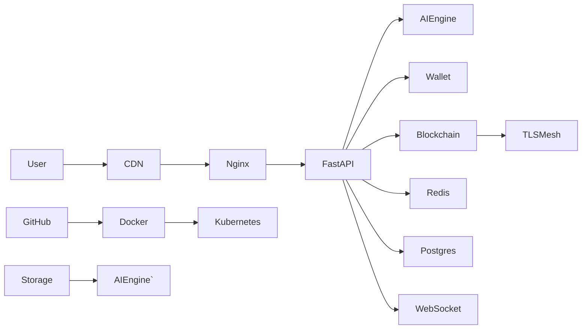

# Developer documentation

The GitBook developer platform allows developers to extend its capabilities with a robust set of tools and resources.

### Discover the platform

<table data-view="cards"><thead><tr><th></th><th></th><th data-hidden data-type="image">Cover image (dark)</th><th data-hidden data-card-cover data-type="image">Cover image</th><th data-hidden data-card-target data-type="content-ref"></th><th data-hidden data-card-cover-dark data-type="image">Cover image (dark)</th></tr></thead><tbody><tr><td><strong>Create an integration</strong></td><td>Build custom integrations in GitBook.</td><td><a href="https://2688147996-files.gitbook.io/~/files/v0/b/gitbook-x-prod.appspot.com/o/spaces%2F2SyQSbIa1iYS7z6Dx5di%2Fuploads%2Fgit-blob-8bdfaa5f939f0d17faa1da4beb0071f3e0774d01%2FNode.js.svg?alt=media">Node.js.svg</a></td><td><a href="https://2688147996-files.gitbook.io/~/files/v0/b/gitbook-x-prod.appspot.com/o/spaces%2F2SyQSbIa1iYS7z6Dx5di%2Fuploads%2Fz5SvZSImduS2fFoKsGx2%2Fcreate-an-integration.png?alt=media&#x26;token=76802f76-0821-4478-b812-19d5e150a2d9">create-an-integration.png</a></td><td><a href="integrations/quickstart">quickstart</a></td><td><a href="https://2688147996-files.gitbook.io/~/files/v0/b/gitbook-x-prod.appspot.com/o/spaces%2F2SyQSbIa1iYS7z6Dx5di%2Fuploads%2FEZknW2N3cCMPnFjL6wRn%2Fcreate-an-integration-1.png?alt=media&#x26;token=7fe79a28-ec8e-4b1c-98dc-0c8690114245">create-an-integration-1.png</a></td></tr><tr><td><strong>Use the API</strong></td><td>Explore the GitBook API.</td><td><a href="https://2688147996-files.gitbook.io/~/files/v0/b/gitbook-x-prod.appspot.com/o/spaces%2F2SyQSbIa1iYS7z6Dx5di%2Fuploads%2Fgit-blob-fd33379177b7c358cd9e789478e56da78c00b1ba%2FGitBook%20API.svg?alt=media">GitBook API.svg</a></td><td><a href="https://2688147996-files.gitbook.io/~/files/v0/b/gitbook-x-prod.appspot.com/o/spaces%2F2SyQSbIa1iYS7z6Dx5di%2Fuploads%2Fx8tStb3jklfqK4UZtlel%2Fuse-the-api.png?alt=media&#x26;token=22a8ee52-0bef-45f5-af75-78e78660399e">use-the-api.png</a></td><td><a href="gitbook-api/api-reference">api-reference</a></td><td><a href="https://2688147996-files.gitbook.io/~/files/v0/b/gitbook-x-prod.appspot.com/o/spaces%2F2SyQSbIa1iYS7z6Dx5di%2Fuploads%2FhmKlx1r3CPZ6u0sjopP3%2Fuse-the-api-1.png?alt=media&#x26;token=7dca049d-97f0-4f5f-b3e6-59fc50e99dd3">use-the-api-1.png</a></td></tr><tr><td><strong>Work with the CLI</strong></td><td>Install the CLI to interact with the developer platform.</td><td><a href="https://2688147996-files.gitbook.io/~/files/v0/b/gitbook-x-prod.appspot.com/o/spaces%2F2SyQSbIa1iYS7z6Dx5di%2Fuploads%2Fgit-blob-fc6d3a894ecf99d55e18660aff8d96bb26eec2c5%2FCLI.svg?alt=media">CLI.svg</a></td><td><a href="https://2688147996-files.gitbook.io/~/files/v0/b/gitbook-x-prod.appspot.com/o/spaces%2F2SyQSbIa1iYS7z6Dx5di%2Fuploads%2F0J6qRA0Ozk9NrjoRwMqZ%2Fcli.png?alt=media&#x26;token=9c4f1692-924e-47ff-b125-dbb7efb4c35b">cli.png</a></td><td><a href="integrations/reference">reference</a></td><td><a href="https://2688147996-files.gitbook.io/~/files/v0/b/gitbook-x-prod.appspot.com/o/spaces%2F2SyQSbIa1iYS7z6Dx5di%2Fuploads%2FYNQvMGQo6LIdrV18bc26%2Fcli-1.png?alt=media&#x26;token=7947d214-c10b-4bc3-8b5f-1b3f231d5c3f">cli-1.png</a></td></tr></tbody></table>    
 
# Web4 System Architecture

## Live System Map

# About custom domains and GitHub Pages

GitHub Pages supports using custom domains, or changing the root of your site's URL from the default, like mu.github.io, to any domain you own.

## Supported custom domains

> \[!TIP]
> We recommend verifying your custom domain prior to adding it to your repository, in order to improve security and avoid takeover attacks. For more information, see [Verifying your custom domain for GitHub Pages](/en/pages/configuring-a-custom-domain-for-your-github-pages-site/verifying-your-custom-domain-for-github-pages).

GitHub Pages works with two types of domains: subdomains and apex domains. For a list of unsupported custom domains, see [Troubleshooting custom domains and GitHub Pages](/en/pages/configuring-a-custom-domain-for-your-github-pages-site/troubleshooting-custom-domains-and-github-pages#custom-domain-names-that-are-unsupported).

| Supported custom domain type | Example            |
| ---------------------------- | ------------------ |
| `www` subdomain              | `www.example.com`  |
| Custom subdomain             | `blog.example.com` |
| Apex domain                  | `example.com`      |

You can set up either or both of apex and `www` subdomain configurations for your site. For more information on apex domains, see [Using an apex domain for your GitHub Pages site](#using-an-apex-domain-for-your-github-pages-site).

We recommend always using a `www` subdomain, even if you also use an apex domain. When you create a new site with an apex domain, we automatically attempt to secure the `www` subdomain for use when serving your site's content, but you need to make the DNS changes to use the `www` subdomain. If you configure a `www` subdomain, we automatically attempt to secure the associated apex domain. For more information, see [Managing a custom domain for your GitHub Pages site](/en/pages/configuring-a-custom-domain-for-your-github-pages-site/managing-a-custom-domain-for-your-github-pages-site).

## Using a custom domain across multiple repositories

By default, if you set a custom domain for a **user site** or **organization site**, that same custom domain will be used for all project sites owned by the same account. For more information about site types, see [What is GitHub Pages?](/en/pages/getting-started-with-github-pages/what-is-github-pages#types-of-github-pages-sites).

For example, if the custom domain for your user site is `www.octocat.com`, and you have a project site with no custom domain configured that is published from a repository called `octo-project`, the GitHub Pages site for that repository will be available at `www.octocat.com/octo-project`.

You can override the default custom domain by adding a custom domain to the individual repository.

> \[!NOTE]
> The URLs for project sites that are privately published are not affected by the custom domain for your user or organization site. For more information about privately published sites, see [Changing the visibility of your GitHub Pages site](/en/enterprise-cloud@latest/pages/getting-started-with-github-pages/changing-the-visibility-of-your-github-pages-site) in the GitHub Enterprise Cloud documentation.

To remove the default custom domain, you must remove the custom domain from your user or organization site.

## Using a subdomain for your GitHub Pages site

A subdomain is the part of a URL before the root domain. You can configure your subdomain as `www` or as a distinct section of your site, like `blog.example.com`.

Subdomains are configured with a `CNAME` record through your DNS provider. For more information, see [Managing a custom domain for your GitHub Pages site](/en/pages/configuring-a-custom-domain-for-your-github-pages-site/managing-a-custom-domain-for-your-github-pages-site#configuring-a-subdomain).

### `www` subdomains

A `www` subdomain is the most commonly used type of subdomain. For example, `www.example.com` includes a `www` subdomain.

`www` subdomains are the most stable type of custom domain because `www` subdomains are not affected by changes to the IP addresses of GitHub's servers.

### Custom subdomains

A custom subdomain is a type of subdomain that doesn't use the standard `www` variant. Custom subdomains are mostly used when you want two distinct sections of your site. For example, you can create a site called `blog.example.com` and customize that section independently from `www.example.com`.

## Using an apex domain for your GitHub Pages site

An apex domain is a custom domain that does not contain a subdomain, such as `example.com`. Apex domains are also known as base, bare, naked, root apex, or zone apex domains.

An apex domain is configured with an `A`, `ALIAS`, or `ANAME` record through your DNS provider. For more information, see [Managing a custom domain for your GitHub Pages site](/en/pages/configuring-a-custom-domain-for-your-github-pages-site/managing-a-custom-domain-for-your-github-pages-site#configuring-an-apex-domain).

If you are using an apex domain as your custom domain, we recommend also setting up a `www` subdomain. If you configure the correct records for each domain type through your DNS provider, GitHub Pages will automatically create redirects between the domains. For example, if you configure `www.example.com` as the custom domain for your site, and you have GitHub Pages DNS records set up for the apex and `www` domains, then `example.com` will redirect to `www.example.com`. If you instead configure `example.com` as the custom domain, then `www.example.com` will redirect to `example.com`. Automatic redirects also apply to other subdomains, as `www.blog.example.com` will redirect to `blog.example.com` or vice versa. It is not possible to configure a domain that starts with `www.www.`. For more information, see [Managing a custom domain for your GitHub Pages site](/en/pages/configuring-a-custom-domain-for-your-github-pages-site/managing-a-custom-domain-for-your-github-pages-site#configuring-a-subdomain).

## Securing the custom domain for your GitHub Pages site

If your GitHub Pages site is disabled but has a custom domain set up, it is at risk of a domain takeover. Having a custom domain configured with your DNS provider while your site is disabled could result in someone else hosting a site on one of your subdomains.

Verifying your custom domain prevents other GitHub users from using your domain with their repositories. If your domain is not verified, and your GitHub Pages site is disabled, you should immediately update or remove your DNS records with your DNS provider. For more information, see [Verifying your custom domain for GitHub Pages](/en/pages/configuring-a-custom-domain-for-your-github-pages-site/verifying-your-custom-domain-for-github-pages) and [Managing a custom domain for your GitHub Pages site](/en/pages/configuring-a-custom-domain-for-your-github-pages-site/managing-a-custom-domain-for-your-github-pages-site).

There are a couple of reasons your site might be automatically disabled.

* If you downgrade from GitHub Pro to GitHub Free, any GitHub Pages sites that are currently published from private repositories in your account will be unpublished. For more information, see [Downgrading your account's plan](/en/billing/how-tos/manage-plan-and-licenses/downgrade-plan).
* If you transfer a private repository to a personal account that is using GitHub Free, the repository will lose access to the GitHub Pages feature, and the currently published GitHub Pages site will be unpublished. For more information, see [Transferring a repository](/en/repositories/creating-and-managing-repositories/transferring-a-repository).

## Further reading

* [Troubleshooting custom domains and GitHub Pages](/en/pages/configuring-a-custom-domain-for-your-github-pages-site/troubleshooting-custom-domains-and-github-pages)
